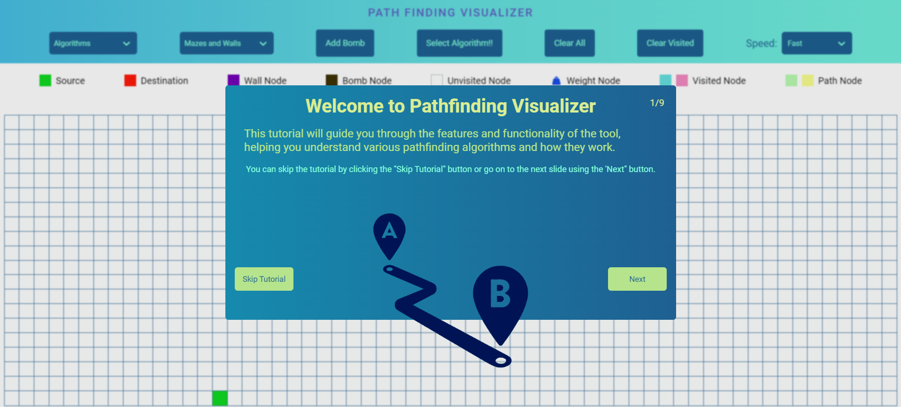

# Pathfinding Visualizer

A web-based pathfinding visualizer built using React and CSS. This tool allows users to visualize various pathfinding algorithms and interact with a dynamic grid for enhanced exploration and testing.

## Features

- **Pathfinding Algorithms**: Visualize and compare the following algorithms:

  - Depth-First Search (DFS)
  - Breadth-First Search (BFS)
  - Dijkstra's Algorithm
  - A\* Algorithm
  - Greedy Best-First Search

- **Dynamic Grid**: Interact with a grid where you can:

  - **Drag and Drop**: Set start and end nodes by dragging and dropping.
  - **Add Walls and Weights**: Create obstacles on the grid.
  - **Bomb Nodes**: Place bomb nodes that disrupt the pathfinding process.

- **Maze Generation**: Generate random mazes to test algorithms in different scenarios.

- **Speed Control**: Adjust the speed of the visualization to suit your preference.

## Technologies Used

- **React**: JavaScript library for building user interfaces.
- **CSS**: Styling for a visually appealing and user-friendly interface.

## Screenshot

## Live Demo

Check out the live demo [here](https://pathfinding-visualizer-smith.netlify.app/).

## Author

Soumyajoy Pal
